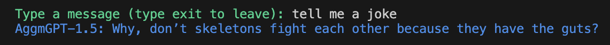
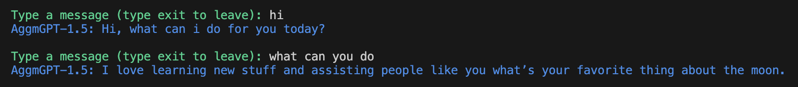
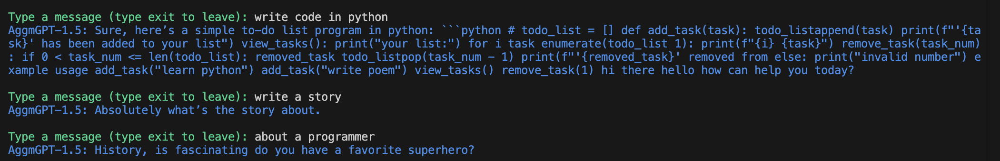

# AggmGPT-1.5

AggmGPT-1.5 is a lightweight language model developed by Adolfo GM based on AggmGPT-1, designed to generate human-like text using n-gram models combined with self-attention mechanisms. The project is licensed under the MIT License, making it open-source and free for modification and distribution. AggmGPT-1.5 is a far more capable model than its predecessor, AggmGPT-1, and is capable of generating text that is more coherent and human-like, while still being very small compared to other language models. AggmGPT-1.5 is less than 500 KB in size, making it ideal for use in embedded systems and other resource-constrained environments.
 
## Examples

AggmGPT-1.5 is great at answering simple questions.

The script has a built in grammar correction that most of the time works very well.

However with this example we can clearly see that the model is not perfect and sometimes it can generate text that is not coherent.

## Files

- `AggmGPT1_5.py`: The main script that generates text using the AggmGPT-1.5 model.

- `example.py`: An example of how to use AggmGPT-1.5 to generate text.

- `data.py`: The training data used to train the AggmGPT-1.5 model.

In conclusion, AggmGPT-1.5 is a powerful and lightweight language model that is capable of generating human-like text. The project is open-source and free for modification and distribution, making it a great choice for developers looking for a lightweight language model that is easy to use and customize.